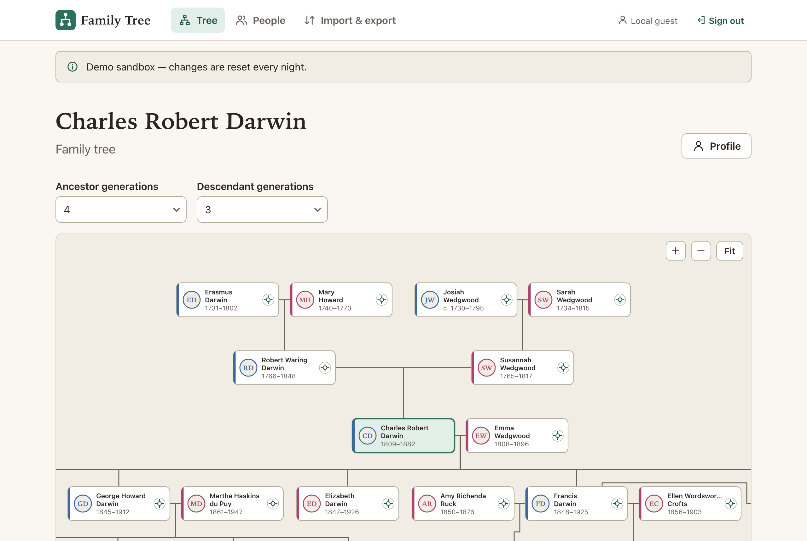
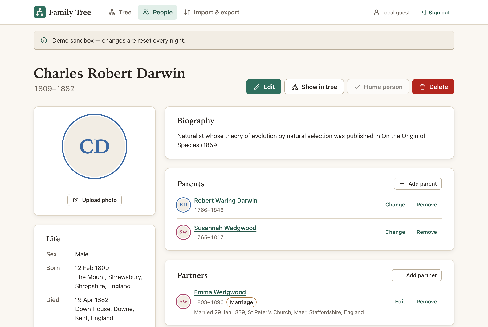
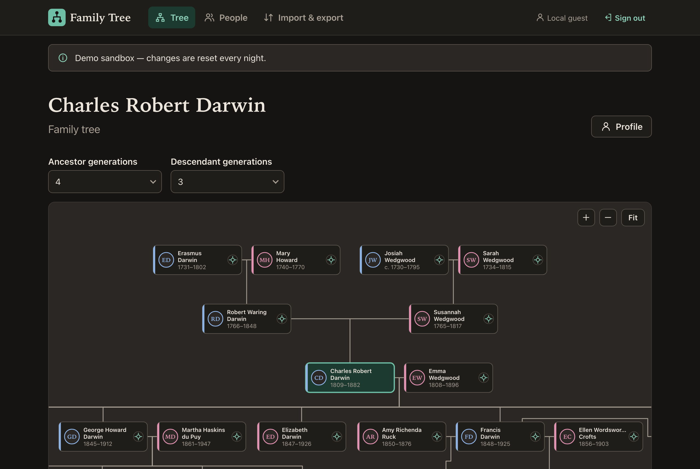
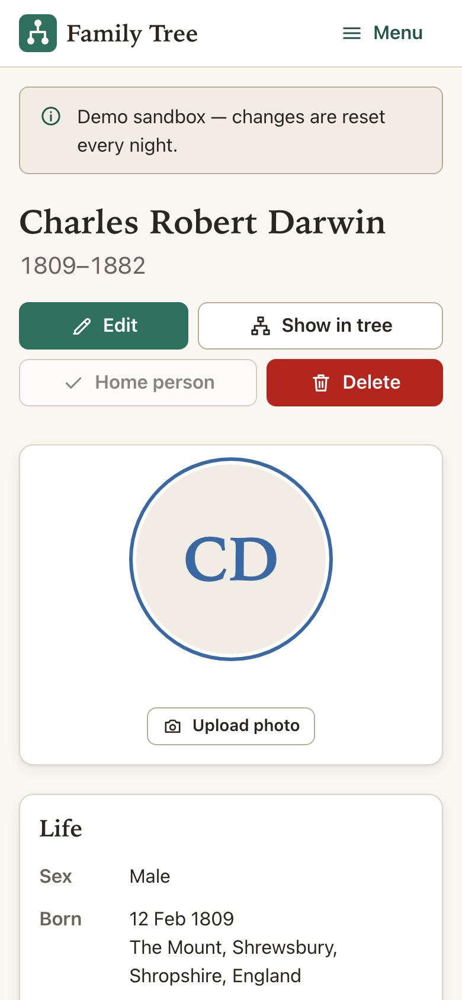
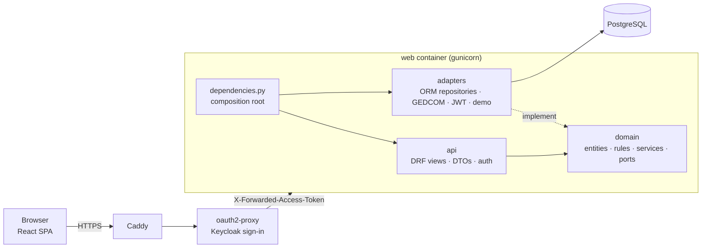

# Family Tree

[](https://github.com/aluppol/family-tree/actions/workflows/ci.yml)
[](LICENSE)

A genealogy application for keeping a large extended family straight — React and Vite on the front, a Django API and Postgres behind it.

Most of us know almost nothing about our great-great-grandparents. Family Tree keeps who they were — names, dates that are often only "about 1765", places, a short story and a portrait — and draws the lines between generations: parents (birth, adoptive, foster), partners and marriages over time, and a pan-and-zoom chart of ancestors and descendants. Files move in and out as GEDCOM, the format every genealogy program speaks.



| A profile with relatives | Dark theme | On a phone |
|---|---|---|
|  |  |  |

The demo family is real: Charles Darwin married his first cousin Emma Wedgwood, and his sister Caroline married Emma's brother, so Josiah Wedgwood I is an ancestor of their children twice over. Every date is checked against published sources ([docs/demo-family-sources.md](docs/demo-family-sources.md)).

## Features

| | What you can do | Proved by |
|---|---|---|
| People | Add, edit and delete people with given names, surname, sex, birth and death (date and place) and a biography; search by any part of a name | `backend/tests/api/test_people.py`, `frontend/src/features/person-form`, `frontend/e2e` |
| Genealogical dates | Exact, month and year, year only, about, calculated, estimated, before, after, between — stored as written, never shifted by time zones | `backend/tests/domain/test_dates.py`, `test_date_notation.py` |
| Parents and children | Link birth, adoptive, foster and other parents; pick them from a search that already leaves out the person, their descendants and existing parents | `backend/tests/api/test_kinship.py` |
| Partners | Marriages and partnerships with start and end (divorce, annulment, separation); remarriage of the same couple | `backend/tests/api/test_kinship.py` |
| Integrity | Nobody is their own parent or partner, no loops of ancestry, no parent born after a child, no death before birth, at most two birth parents — explained in plain words when refused | `backend/tests/domain/test_kinship_rules.py` |
| Chart | An hourglass of ancestors above and descendants below, couples side by side, children under the couple, repeated ancestors marked; pan and zoom with mouse, trackpad or touch | `frontend/src/features/chart`, `backend/tests/api/test_chart.py` |
| Photos | Upload a portrait (resized in the browser), shown on the profile and on chart cards; type checked by content, not by name | `backend/tests/api/test_photos.py` |
| GEDCOM | Import GEDCOM 5.5.1, 7.0 and GEDZIP with a preview of what will be added and what is skipped and why, all or nothing; export all three | `backend/tests/adapters/gedcom`, `backend/tests/api/test_gedcom.py` |
| Scale | 5,000 people import in seconds; the chart is always four SQL queries, whatever the size of the family | `backend/tests/api/test_performance.py`, `test_chart.py` |
| API | Every endpoint documented as OpenAPI 3 at `/api/docs/` | `backend/tests/api/test_schema.py` |

## Quick start

With Docker:

```bash
cp .env.example .env
docker compose up --build
```

Open http://localhost:8080. A stand-in gateway signs you in as a local guest, who gets a private copy of the Darwin–Wedgwood family.

Without Docker you need Python 3.13, Node 24 (see `.nvmrc`) and a PostgreSQL 16+ database:

```bash
cd backend
python3.13 -m venv .venv
.venv/bin/pip install --require-hashes -r requirements-dev.txt
cp .env.example .env            # then point POSTGRES_* at your database
set -a; . ./.env; set +a
.venv/bin/python manage.py migrate
.venv/bin/python manage.py issue_development_identity .dev-identity
.venv/bin/python manage.py runserver 8000

cd ../frontend                   # in a second terminal
nvm use
npm ci
npm run dev                      # http://localhost:3000
```

The Vite dev server forwards `/api` to Django and adds the development token, exactly as the production gateway adds the real one.

## Architecture



- **Hexagonal backend.** `backend/family_tree/domain` holds frozen dataclasses, the kinship rules and the services, and knows nothing about Django. Ports are `typing.Protocol`s; `adapters/persistence` implements them with the ORM (every table has an entity, a mapper and a model), a Unit of Work owns transactions, and the database clock writes the timestamps. `api` only translates HTTP into domain calls; `dependencies.py` is the one place that wires them together.
- **One authentication path.** The app trusts no header on its own: every request carries a Keycloak access token that the app verifies itself (signature from the realm's JWKS, issuer, audience `familytree`, expiry). Members get a private tree; the shared guest login gets a sandbox per session, seeded with the demo family and wiped nightly by `demo-reset`. Locally the same code verifies a development token signed by a key made on your machine — there is no switch that turns authentication off.
- **The chart in constant time.** A recursive CTE walks ancestors and descendants in one query; partners, people and links follow in three more. The layout — a tidy hourglass with pedigree collapse — happens in the browser (`frontend/src/features/chart/layout`).
- **Dates as genealogists write them.** A `GenealogicalDate` is a qualifier plus a calendar date with optional month and day; rules compare the earliest and latest possible days, so "about 1815" never contradicts "1809".
- **Append-only migrations.** The 2023 migration `0001_initial` is kept as it shipped; later migrations move its table into the new model and carry any old rows across.
- **Frontend.** React 19, React Router, TanStack Query, TypeScript strict, SCSS modules on design tokens with light and dark themes. Presenter components own data; view components only render.

## Development

| Task | Backend (`backend/`) | Frontend (`frontend/`) |
|---|---|---|
| Lint | `ruff check . && ruff format --check .` | `npm run lint` |
| Types | `mypy .` (strict) | `npm run typecheck` |
| Tests | `python -m pytest --cov` (≥ 90 % lines and branches) | `npm run test:coverage` (≥ 80 %) |
| Advisories | `pip-audit --require-hashes -r requirements.txt -r requirements-dev.txt` | `npm audit` |
| End to end | — | `npx playwright test` against `docker compose up` |

The code has no comments and functions stay under 30 lines; tests enforce both (`backend/tests/test_code_rules.py`, the `code/no-comments` ESLint rule).

CI (`.github/workflows/ci.yml`) runs all of the above on every push to `dev`, builds the image, starts the production compose file with throwaway secrets and runs `deploy/smoke.sh`. A green `dev` commit is promoted to `main`, which deploys it (`deploy.yml`).

## API

The OpenAPI schema is served at `/api/schema/` and rendered at `/api/docs/`. All paths live under `/api/` and end with a slash; errors are always `{"error": {"code", "message", "fields"}}`.

## Roadmap

Not built yet, in rough order: sources and citations, more events (baptism, burial, residence, occupation) instead of skipping them on import, places as their own records with maps, several trees per person and sharing a tree with relatives, privacy rules for living people, a timeline view, and undo.

## License

MIT — see [LICENSE](LICENSE). Made by [Albert Luppol](https://albert.luppol.com).
